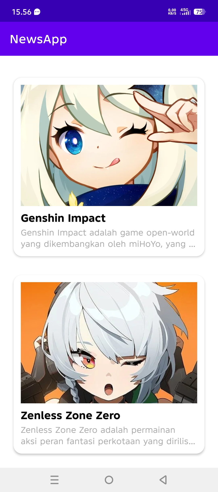
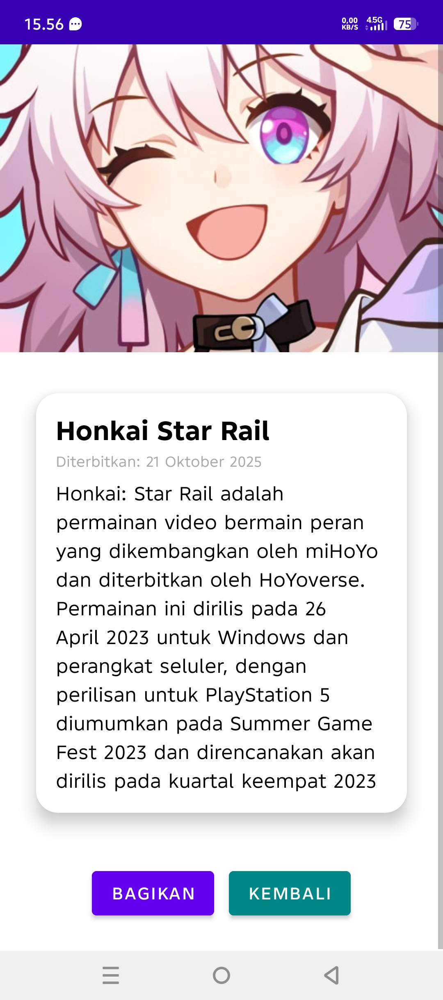
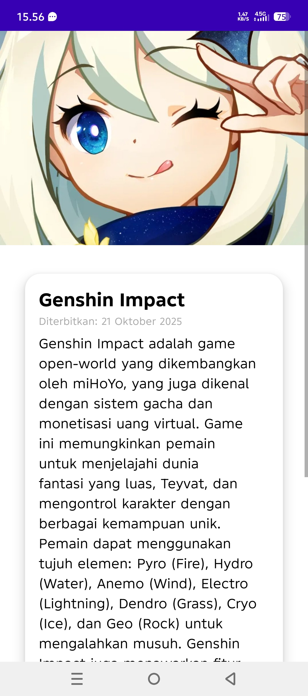
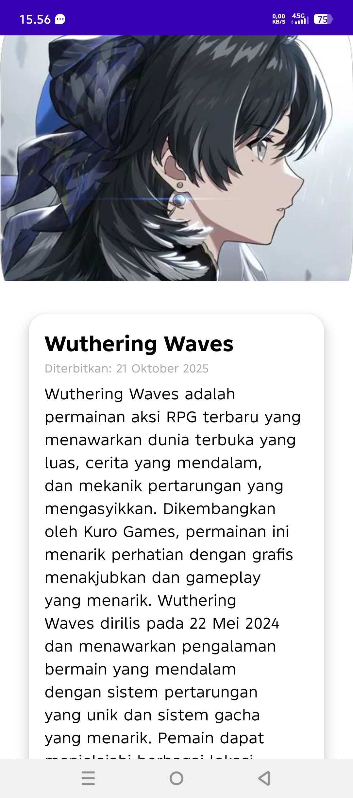
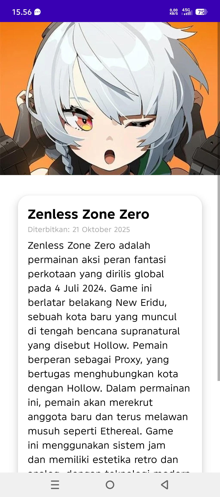

# 📰 NewsApp — *Portal Game & Anime*

Aplikasi berita interaktif yang menampilkan informasi terbaru seputar dunia **game dan anime** dengan tampilan modern berbasis **Android Studio (Java)**.  
Menampilkan berbagai berita populer seperti *Honkai: Star Rail*, *Genshin Impact*, *Wuthering Waves*, dan *Zenless Zone Zero*.

---

## 🖼️ Tampilan Aplikasi

### 🧭 Halaman Navigasi
Tampilan utama aplikasi berisi daftar berita dengan desain **CardView** yang elegan dan deskripsi singkat di setiap item.

---

### 🌌 Honkai: Star Rail
Tampilan halaman detail berita dengan gambar penuh, judul besar, dan tombol interaktif seperti **Bagikan** dan **Kembali**.

---

### 🌿 Genshin Impact
Desain rapi dan responsif untuk menampilkan konten berita dengan tampilan card dan layout dinamis.

---

### 🌊 Wuthering Waves
Halaman berita dengan konten visual yang kaya dan transisi lembut antar aktivitas.

---

### ⚡ Zenless Zone Zero
UI modern dengan tema futuristik, menonjolkan gambar utama dan teks yang mudah dibaca.

---

## 💡 Fitur Utama
- Desain **UI/UX modern** dengan CardView dan efek klik halus.  
- Setiap berita menampilkan **gambar, judul, dan deskripsi singkat**.  
- Halaman detail dilengkapi tombol **Bagikan Berita** dan **Kembali**.  
- Data berita dikelola melalui class `NewsItem` dan adapter dinamis (`NewsAdapter.java`).  

---

## 👤 Identitas Pengembang
**Nama:** Muhammad Al Qadar Ramadhan  
**NIM:** 237200003  

---

© 2025 NewsApp — *Portal Game & Anime*
